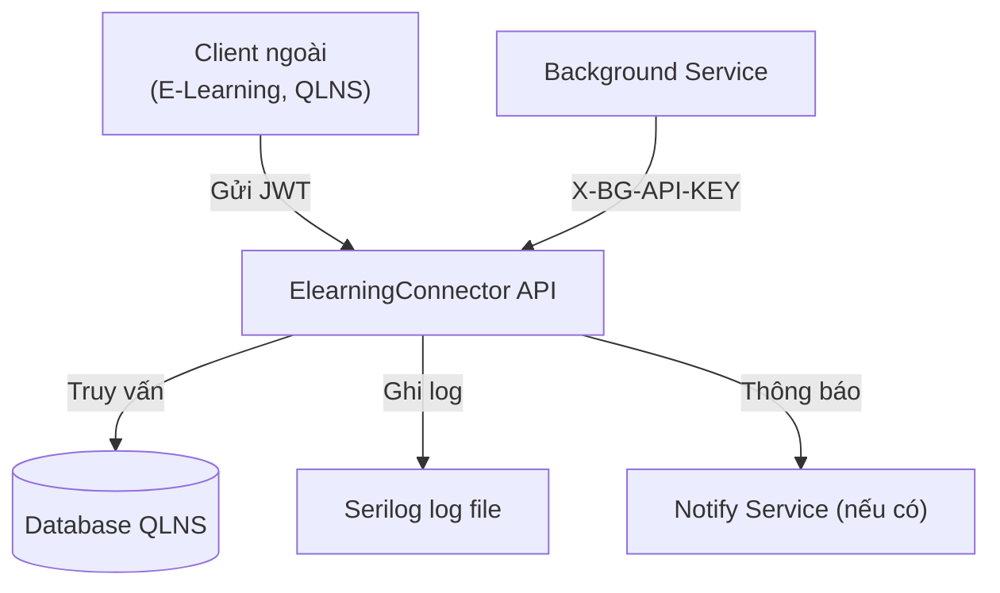
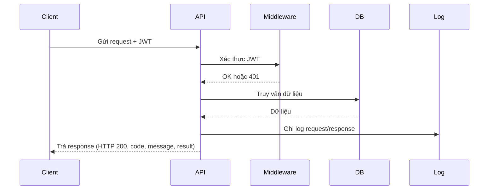
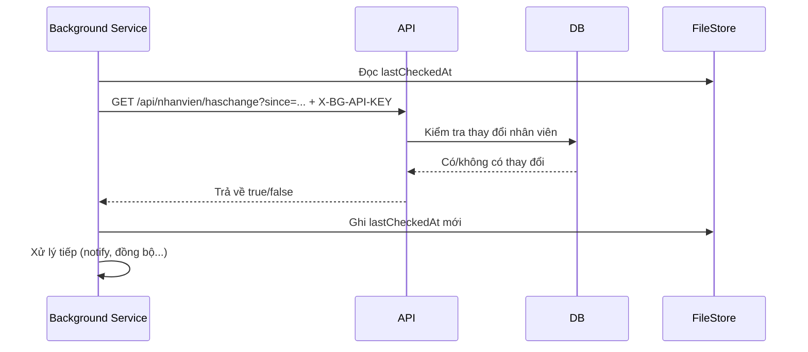

# ElearningConnector API

## 1. Giới thiệu
**ElearningConnector** là RESTful API trung gian giúp đồng bộ dữ liệu nhân sự (tài khoản, phòng ban, chức vụ, cán bộ) giữa hệ thống Quản lý nhân sự (QLNS) và hệ thống E-Learning. Dự án hướng tới chuẩn hóa giao tiếp, bảo mật, dễ tích hợp, dễ mở rộng.

## 2. Kiến trúc tổng thể
- ASP.NET Core 8, Entity Framework Core, SQL Server.
- Xác thực JWT cho API public.
- Endpoint nội bộ bảo vệ bằng X-BG-API-KEY.
- Logging Serilog ra file.
- Test tự động xUnit.



## 3. Luồng hoạt động chi tiết

### 3.1. Luồng hoạt động API public (dành cho client ngoài)
**Mục tiêu:** Đảm bảo chỉ người dùng hợp lệ mới truy cập được dữ liệu nhân sự, mọi thao tác đều được log và trả về kết quả chuẩn hóa.

#### Các bước cụ thể:
1. **Client gửi request**
   - Gửi HTTP request (POST/GET) tới API endpoint (ví dụ: `/api/danhsachcanbo`).
   - **Bắt buộc:** Thêm header `Authorization: Bearer <JWT token>` (lấy từ bước đăng nhập).
   - **Ví dụ:**
     ```bash
     curl -X POST https://yourdomain/api/danhsachcanbo \
       -H "Authorization: Bearer <JWT token>" \
       -H "Content-Type: application/json" \
       -d '{"page":1,"pageSize":20}'
     ```
2. **Middleware xác thực JWT**
   - Hệ thống kiểm tra JWT token ở header.
   - Nếu token hợp lệ → cho phép đi tiếp.
   - Nếu token thiếu/hết hạn/sai → trả về HTTP 401 Unauthorized.
3. **Controller xử lý nghiệp vụ**
   - Nhận request, kiểm tra quyền truy cập (nếu cần).
   - Thực hiện logic nghiệp vụ: truy vấn DB, phân trang, lọc dữ liệu, chuẩn hóa kết quả.
4. **Ghi log request/response**
   - Toàn bộ thông tin request và response được ghi lại vào file log (Serilog) để phục vụ audit, debug.
5. **Trả response chuẩn hóa**
   - Luôn trả HTTP 200 (trừ lỗi xác thực JWT).
   - Body response luôn có 3 trường: `code`, `message`, `result`.
   - **Ví dụ response thành công:**
     ```json
     {
       "code": "0000",
       "message": "Thành công",
       "result": [ ... ]
     }
     ```
   - **Ví dụ response lỗi nghiệp vụ:**
     ```json
     {
       "code": "0002",
       "message": "Tài khoản hoặc mật khẩu không chính xác",
       "result": null
     }
     ```

**Lưu ý:**
- Nếu thiếu JWT hoặc JWT không hợp lệ, API trả về HTTP 401, client cần đăng nhập lại để lấy token mới.
- Mọi lỗi nghiệp vụ (sai tham số, không tìm thấy dữ liệu, v.v.) đều trả HTTP 200, nhưng code khác "0000".



---

### 3.2. Luồng hoạt động Background Service (nội bộ)
**Mục tiêu:** Cho phép các tiến trình nền kiểm tra thay đổi dữ liệu nhân viên để thực hiện đồng bộ, cảnh báo hoặc automation mà không cần JWT.

#### Các bước cụ thể:
1. **Service nền đọc thời gian kiểm tra gần nhất**
   - Đọc từ file (ví dụ: `lastCheckedAt.txt`) để biết lần cuối đã kiểm tra là khi nào.
2. **Gửi request kiểm tra thay đổi**
   - Gửi HTTP GET tới `/api/nhanvien/haschange?since=<lastCheckedAt>`
   - **Bắt buộc:** Thêm header `X-BG-API-KEY: <key>` (lấy từ cấu hình nội bộ, không phải JWT).
   - **Ví dụ:**
     ```bash
     curl -X GET "https://yourdomain/api/nhanvien/haschange?since=2024-06-25T00:00:00Z" \
       -H "X-BG-API-KEY: my-super-secret-key-123"
     ```
3. **API xác thực key nội bộ**
   - Nếu key hợp lệ → cho phép kiểm tra tiếp.
   - Nếu key sai hoặc thiếu → trả về HTTP 401 Unauthorized.
4. **API kiểm tra thay đổi dữ liệu nhân viên**
   - Truy vấn DB, xác định có thay đổi nào kể từ thời điểm `since` không.
5. **API trả về kết quả**
   - Response body: `{ "code": "0000", "message": "Thành công", "result": true/false }`
   - `result = true` nếu có thay đổi, `false` nếu không.
6. **Service nền xử lý kết quả**
   - Nếu có thay đổi (`result = true`): thực hiện các tác vụ tiếp theo (gửi notify, trigger đồng bộ, ...).
   - Nếu không có thay đổi: không làm gì thêm.
7. **Lưu lại thời gian kiểm tra**
   - Ghi lại thời điểm kiểm tra vào file để lần sau tiếp tục kiểm tra từ mốc mới.
8. **Ghi log hoạt động**
   - Ghi lại mọi thao tác, kết quả, lỗi (nếu có) để dễ debug và audit.

**Lưu ý:**
- Endpoint này chỉ dành cho tiến trình/service nội bộ, không dành cho client ngoài.
- Không liên quan đến xác thực JWT.
- Nếu cả JWT và X-BG-API-KEY đều thiếu/sai, API sẽ trả về lỗi xác thực.



---

## 4. Luồng xác thực & bảo mật
- **API public:**
  - Đăng nhập qua `/api/authen` lấy JWT.
  - Gửi JWT ở header: `Authorization: Bearer <token>` cho các API cần xác thực.
- **Endpoint nội bộ:**
  - Gửi header `X-BG-API-KEY: <key>` (lấy từ appsettings) cho các service nền.

## 5. Endpoint & ví dụ sử dụng

### 5.1. Đăng nhập lấy JWT
- **POST /api/authen**
- Body:
```json
{
  "userName": "string",
  "passWord": "string"
}
```
- Response mẫu:
```json
{
  "code": "0000",
  "message": "Thành công",
  "result": {
    "token": "<JWT token>",
    "userName": "string"
  }
}
```
- **Ví dụ curl:**
```bash
curl -X POST https://yourdomain/api/authen \
  -H "Content-Type: application/json" \
  -d '{"userName":"demo","passWord":"demo"}'
```

### 5.2. Lấy danh sách cán bộ (cần JWT)
- **POST /api/danhsachcanbo**
- Header: `Authorization: Bearer <JWT token>`
- Body:
```json
{
  "page": 1,
  "pageSize": 20,
  "keywords": ""
}
```
- Response mẫu:
```json
{
  "code": "0000",
  "message": "Thành công",
  "result": [
    { "maNhanVien": "001", "hoTen": "Nguyễn Văn A", ... }
  ]
}
```
- **Ví dụ curl:**
```bash
curl -X POST https://yourdomain/api/danhsachcanbo \
  -H "Authorization: Bearer <JWT token>" \
  -H "Content-Type: application/json" \
  -d '{"page":1,"pageSize":20}'
```

### 5.3. Lấy danh sách phòng ban/chức vụ (cần JWT)
- **POST /api/phongban**
- **POST /api/chucvu**
- Header: `Authorization: Bearer <JWT token>`
- Body: `{}`
- Response: giống mẫu trên.

## 6. Chuẩn hóa response
- Luôn trả HTTP 200, mã lỗi nghiệp vụ nằm trong trường `code`.
- Các trường hợp lỗi xác thực JWT trả về 401.

## 7. Mã lỗi
| Code   | Ý nghĩa                                    |
|--------|--------------------------------------------|
| 0000   | Thành Công                                 |
| 0001   | Lỗi hệ thống                               |
| 0002   | Tài khoản hoặc mật khẩu không chính xác     |

## 8. Logging & Audit
- Ghi toàn bộ request/response ra file txt theo ngày (Serilog, logs/ElearningConnector_log-YYYYMMDD.txt).
- Dùng để debug, audit, truy vết sự cố.

## 9. Test tự động
- Sử dụng xUnit, test các luồng chính: đăng nhập, xác thực JWT, truy vấn dữ liệu, kiểm tra mã lỗi.

## 10. Cấu hình
- File `appsettings.json`:
```json
{
  "Jwt": {
    "Key": "SuperSecretKeyForJwtToken1234567890!!",
    "Issuer": "ElearningConnector",
    "Audience": "ElearningConnectorUsers"
  },
  "NhanVienChangeChecker": {
    "CheckIntervalMinutes": 5,
    "CheckApiUrl": "https://yourdomain/api/nhanvien/haschange",
    "BackgroundServiceApiKey": "my-super-secret-key-123"
  }
}
```

## 11. Best Practices & Lưu ý
- Đảm bảo bảo mật JWT Token.
- Đọc log khi cần debug hoặc audit.
- Có thể mở rộng thêm endpoint hoặc logic nghiệp vụ mới dễ dàng nhờ kiến trúc chuẩn hóa.
- Endpoint nội bộ chỉ dùng cho service nền, không public cho client ngoài.

## 12. Background Service (Nội bộ)
### 12.1. Chức năng
- Theo dõi thay đổi dữ liệu nhân viên để phục vụ đồng bộ, cảnh báo, automation nội bộ.
- Chạy dưới dạng service nền, không dành cho client ngoài.

### 12.2. Endpoint nội bộ
- **GET /api/nhanvien/haschange?since=yyyy-MM-ddTHH:mm:ssZ**
- Xác thực:
  - Gửi header: `X-BG-API-KEY: <key>`
  - Key này chỉ dùng cho service nội bộ, không phải JWT, không public cho client ngoài.
- Nếu không có key hoặc key sai, hoặc không có JWT hợp lệ, sẽ trả về lỗi xác thực.

### 12.3. Cấu hình key nội bộ
- Trong file `appsettings.json`:
```json
"NhanVienChangeChecker": {
  "BackgroundServiceApiKey": "my-super-secret-key-123"
}
```
- Service nền sẽ lấy key này để gửi lên header khi gọi endpoint nội bộ.

### 12.4. Ví dụ curl gọi endpoint nội bộ
```bash
curl -X GET "https://yourdomain/api/nhanvien/haschange?since=2024-06-25T00:00:00Z" \
  -H "X-BG-API-KEY: my-super-secret-key-123"
```

### 12.5. Lưu ý
- Endpoint này chỉ dành cho các tiến trình/service nội bộ, không dành cho client ngoài.
- Không liên quan đến xác thực JWT của API public.

## 13. Sơ đồ dữ liệu & model
- Entity: NhanVien, DMChucDanh, DMBoPhan, User, HSNV_LichSuNhanVien...
- DTO: NhanVienDto, ChucDanhDto, BoPhanDto...
- Request model: AuthRequest, PagedRequest...

## 14. Đóng góp & liên hệ
- Đóng góp: tạo PR, issue trên Github hoặc liên hệ trực tiếp.
- Liên hệ: [your-email@domain.com]

---
**Mọi thắc mắc, góp ý hoặc báo lỗi, vui lòng liên hệ hoặc tạo issue trên Github!**